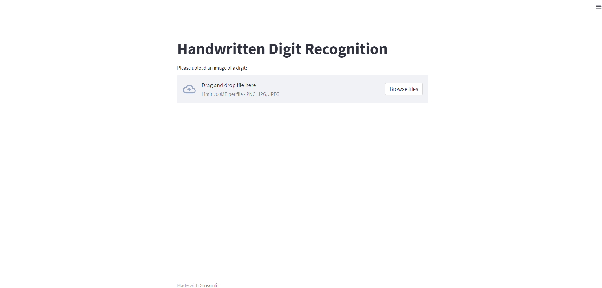
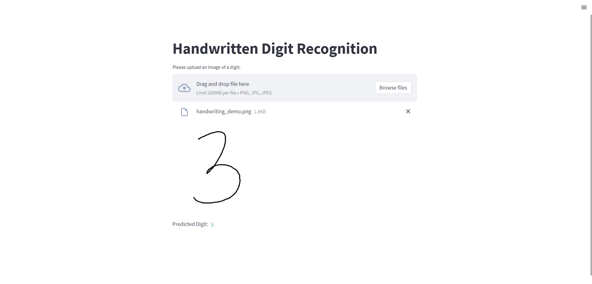

# Digit Recognition Web App

This project is a web application that allows users to upload an image of a handwritten digit, and then uses a simple machine learning model to predict the digit written. The model was trained using the UCI ML Repository handwritten digit dataset.

## How to Use
Upon loading the web app, select the `Browse files` button and upload your image.

For best results:
* Upload square images
* Ensure that the digit fills the entire image

  

Your selected image will be displayed along with the predicted digit underneath.

  

## Technologies

I used NumPy, pandas, and Matplotlib in early stages of my project for image preprocessing. However, my project is largely written using scikit-learn and Streamlit.

## License
This project is licensed under the terms of the MIT license.

## Contact
Created by [Emily Pham](github.com/empham1)
